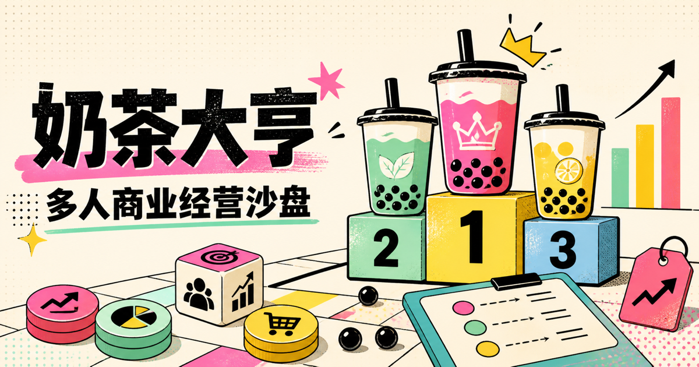

# 🧋 奶茶大亨

> **一间教室，一条商业街。**<br>
> 有人低价走量，有人重金营销，还有人囤了 200 杯鲜奶，然后等来了一场暴雨。

[](https://panpan01bit.github.io/Bubble_tea_sim/)
[](#-30-秒开局)
[](#-它是怎么连起来的)



**奶茶大亨**是一款为商科体验课设计的多人经营沙盘。老师发布隐晦的商业快讯，学生从天气、农业、物流、政策与消费趋势中研判信号，再通过定价、备货和营销争夺市场。

它不要求安装 App，也不需要搭建业务服务器。打开网页、分享教室号，一场迷你商业战争就可以开始。

## ✨ 课堂里会发生什么

- **老师宣布活动开始**：创建教室、设置轮数、发布商业快讯并统一结算。
- **学生组队经营**：每支公司用一台设备加入，决定售价、进货量和营销预算。
- **市场实时竞争**：价格吸引力、营销效率和有限客流共同决定销量。
- **商业新闻研判**：公开的是新闻线索，不公开具体参数；学生需要自行推导成本、需求与风险变化。
- **排行榜同步刷新**：每轮结算后，所有设备都会看到最新现金与名次。
- **商业知识随手抽**：机会成本、价格弹性、盈亏平衡点等概念，随时变成课堂讨论题。
- **数据可以带走**：终局导出 CSV，用真实决策记录完成课堂复盘。

## 🚀 30 秒开局

### 老师

1. 打开[在线版奶茶大亨](https://panpan01bit.github.io/Bubble_tea_sim/)。
2. 选择「我是教师」，填写教室名称和经营轮数。
3. 把系统生成的 **6 位教室号**或邀请链接发给学生。
4. 等公司到齐，宣布商业街正式营业。

### 学生

1. 打开同一个网页，选择「我是学生」。
2. 输入教室号，为公司取一个足够响亮的名字。
3. 和队友讨论策略，每轮提交一次决策。
4. 阅读本轮商业快讯，推导它可能影响的经营变量，再等待结算验证判断。

## 🎯 经营规则

每家公司带着 **¥1,000 启动资金**进入市场：

| 决策 | 可选范围 | 需要思考 |
| --- | ---: | --- |
| 售价 | ¥8–24 / 杯 | 想做哪吒仙饮还是奈雪你自己定 |
| 进货 | 0–200 杯 | 卖完是实力，剩下是损耗 |
| 营销 | ¥0–200 | 花钱能抢客流，但不能保证回本 |

此外，每轮还有 **¥120 固定成本**，基础原料成本为 **¥4/杯**。鲜奶不会等到下一轮，未售库存全部报废；现金也没有“不能为负”的主角光环。再者，我们经营公司要遵守法律法规，篡改保质期和用过期原材料的会吃牢饭。

市场份额由价格、营销和新闻背后的真实市场变化共同决定。真正重要的不是碰运气，而是能否建立“信息—假设—决策—结果”的完整推理链。

## 🧑‍🏫 推荐课堂节奏

1. **组建公司**：确定公司名和队内分工，小小的奶茶店也要有完整的企业架构。
2. **研判快讯**：阅读天气、供应链、政策或消费新闻，提出可能影响经营的假设。
3. **提交决策**：完成定价、进货和营销配置。
4. **揭示影响**：老师公布新闻实际改变了哪些市场参数。
5. **统一结算**：销量、损耗、利润和排名同步更新。
6. **经营复盘**：解释“为什么”，而不只是看“赚多少”。

建议进行 **4–6 轮**。前几轮让学生理解模型，后几轮则会自然出现价格战、差异化经营、风险控制与现金流讨论。

## 🔌 它是怎么连起来的

项目使用 **PeerJS + WebRTC 数据通道**完成多人通信：

- PeerJS Cloud 只负责连接建立时的信令握手；
- 开局后，决策、结算和排行榜在学生与教师浏览器之间直接传输；
- 教师端是唯一权威结算端，无需自建业务后端或数据库；
- 老师需要在比赛期间保持控制台页面开启。

为什么不连接老师电脑的 `localhost`？因为学生设备上的 `localhost` 指向学生自己的设备；同时，GitHub Pages 的 HTTPS 页面访问局域网 HTTP 服务还可能触发混合内容限制。

> 如果校园网络严格限制 WebRTC，建议课前使用教师热点进行一次完整试跑。需要长期断线恢复、历史班级数据或跨复杂网络连接时，可以进一步接入 Firebase、Supabase 等托管实时服务。

## 💻 本地运行

项目是原生 HTML、CSS 和 JavaScript，没有构建步骤，也没有依赖安装仪式。

```bash
git clone https://github.com/panpan01bit/Bubble_tea_sim.git
cd Bubble_tea_sim
python3 -m http.server 8080
```

访问 `http://localhost:8080` 即可。多人联调时，可以用普通窗口扮演老师、无痕窗口扮演学生。

> 不建议直接双击 `index.html`，静态服务器可以避免浏览器对本地文件协议的功能限制。

## 🌐 部署到 GitHub Pages

1. 打开仓库的 **Settings → Pages**。
2. 在部署来源中选择分支部署。
3. 分支选择 `main`，目录选择 `/ (root)`。
4. 保存，等待 GitHub Pages 完成发布。

以后每次推送到 `main`，网页都会自动更新。

## 🗂️ 项目结构

```text
Bubble_tea_sim/
├── index.html          # 身份入口、教师端和学生端页面
├── styles.css         # 响应式视觉设计
├── app.js             # 房间连接、结算、事件、排名与 CSV 导出
├── public/og.png      # 社交分享预览图
└── 活动流程表.xlsx     # 线下课程流程参考
```

## 🥤 最后一句

这不是一个教你“如何卖奶茶”的游戏。

它想让学生在一杯虚拟奶茶里，第一次真正感受到：**每一个经营决定，都有成本。**
